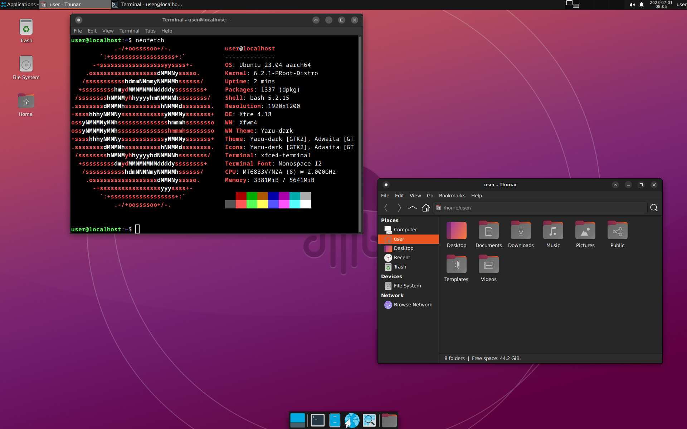
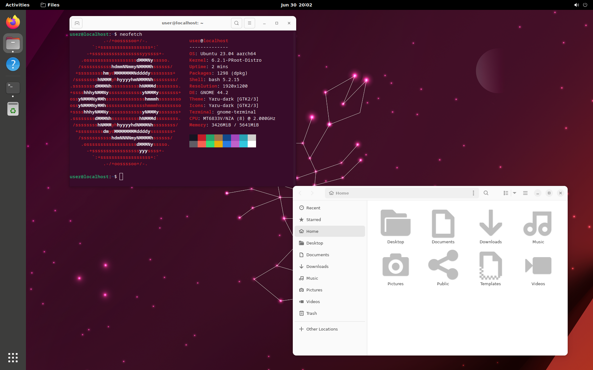
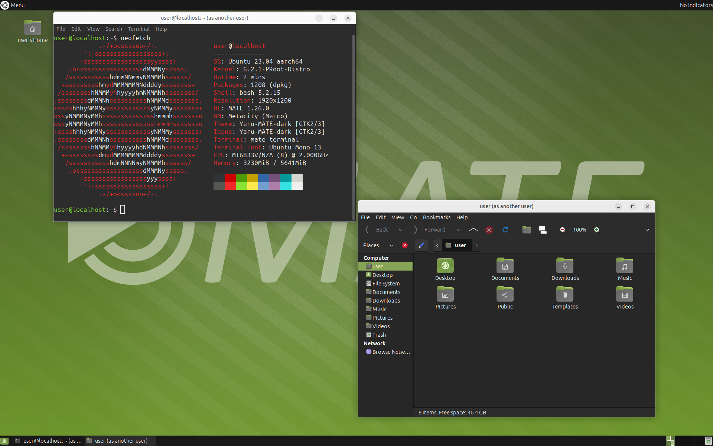
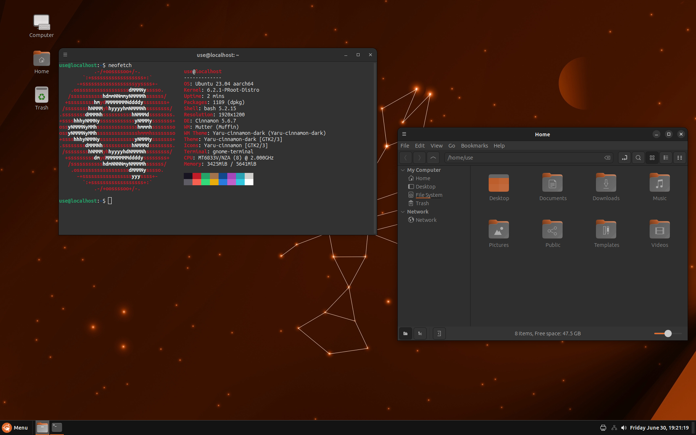
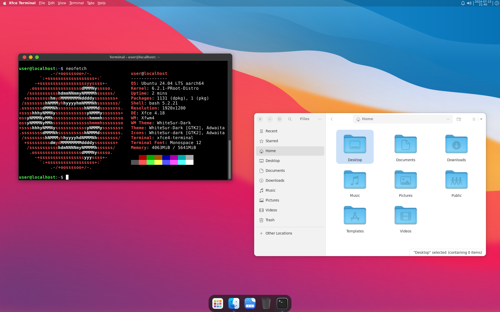
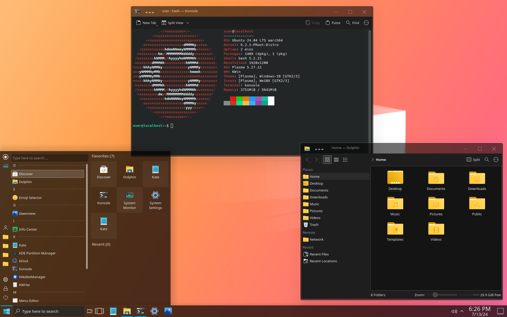

### Termux Ubuntu Installer

<p>A script to install Ubuntu Noble (24.04) in Termux with different desktops,
including GNOME , XFCE , MATE , Cinnamon and KDE desktop . </p>
<p>Also, it provides different desktops with custom theme.</p>

### Notice : Still fixing bugs !!!!

### To Do : 
1) Check bugs in KDE desktop
2) Add some customizations
3) -If error happens delete Termux ap data for fresh install

### Desktops :

<details></br>
<summary><b>XFCE Desktop</b></summary>
<p align="center"></p>
</details>

<details></br>
<summary><b>GNOME Desktop</b></summary>
<p align="center"></p>
</details>

<details></br>
<summary><b>MATE Desktop</b></summary>
<p align="center"></p>
</details>

<details></br>
<summary><b>Cinnamon Desktop</b></summary>
<p align="center"></p>
</details>

### Themes :

- <b>Win11 : (GNOME)</b>
<p align="center"></p>

- <b>MacOS : (XFCE)</b>
<p align="center"></p>

- <b>Win10 : (KDE)</b>
<p align="center"></p>

### Installation

<p> Paste this in termux </p>

```bash 
apt install wget -y 
wget https://raw.githubusercontent.com/23xvx/Termux-Ubuntu-Installer/main/Install.sh
bash Install.sh 
```

### Using ubuntu (if you have installed a desktop)
- [USAGE.md](https://github.com/23xvx/Termux-Ubuntu-Installer/blob/main/USAGE.md)

### Known Bugs :
1) GNOME desktop takes long time to startup
2) Win11 desktop may result in crashing

- <p> Fix 1 and 2: Change startup method to `gnome-shell` instead of `gnome-session` </p>

```bash
sed -i 's/gnome-session/gnome-shell/g' ~/.vnc/xstartup
```

### Third party applications :
- [Webcord](https://github.com/SpacingBat3/WebCord) MIT license 
- [Visual Studio Code](https://code.visualstudio.com) 
- [Termux-app](https://github.com/termux/termux-app) GPLv3 license
- [proot-distro](https://github.com/termux/proot-distro) GPLv3 license

### Credits 
- Win11 themes https://youtu.be/x7LEHV4LRpU
- MacOS themes https://youtu.be/xMeeqzoGI_Y
- Win10 themes https://youtu.be/UZx-F-CSIaw
