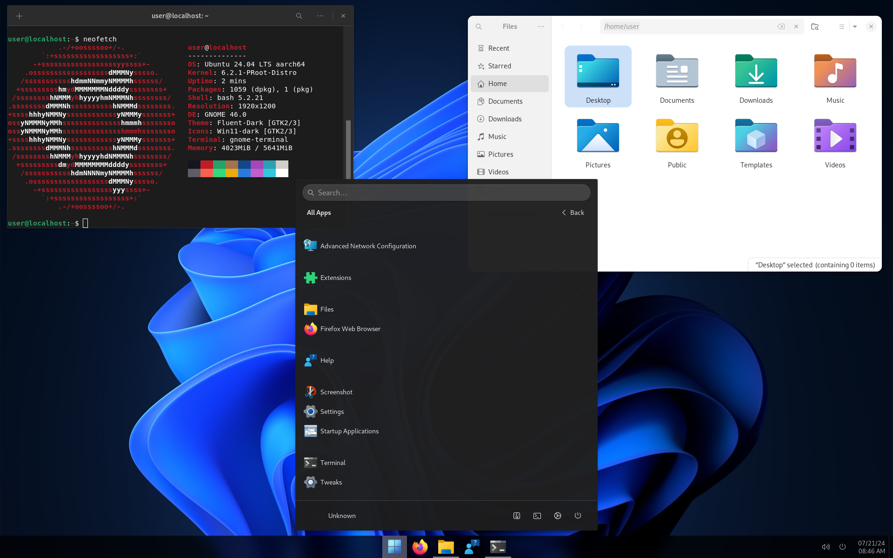

### Termux Ubuntu Installer
 <p>A script to install Ubuntu Lunar (23.04) in Termux with different desktops,
 including GNOME , XFCE , MATE , Cinnamon and Budgie desktop . </p>
 <p>Also, it provides different desktops with custom theme.</p>

- Sources from [Ubuntu](https://cloud-images.ubuntu.com)

### Notice : Still fixing bugs !!!!


### To Do : 
1) Adding more themes (MacOS, Windows)

### Desktops :

<details></br>
<summary><b>XFCE Desktop</b></summary>
<p align="center"></p>
</details>

<details></br>
<summary><b>GNOME Desktop</b></summary>
<p align="center"></p>
</details>

<details></br>
<summary><b>MATE Desktop</b></summary>
<p align="center"></p>
</details>

<details></br>
<summary><b>Cinnamon Desktop</b></summary>
<p align="center"></p>
</details>

<details></br>
<summary><b>Budgie Desktop</b></summary>
<p align="center"></p>
</details>

### Themes :

- <b>Win11 : (GNOME)</b>
<p align="center"></p>

- <b>MacOS : (XFCE)</b>
<p align="center"></p>


```bash 
apt install wget -y 
wget https://raw.githubusercontent.com/23xvx/Termux-Ubuntu-Installer/main/Install.sh
bash Install.sh 
```

### Known Bugs :
1) Cannot move or copy files in gnome/cinnamon file manager</br>Solution : Please process in the terminal 

### Third party applications :
- [Webcord](https://github.com/SpacingBat3/WebCord) MIT license 
- [Visual Studio Code](https://code.visualstudio.com) 
- [Termux-app](https://github.com/termux/termux-app) GPLv3 license

### Credits 
- Win11 themes https://youtu.be/x7LEHV4LRpU
- MacOS themes https://youtu.be/xMeeqzoGI_Y 